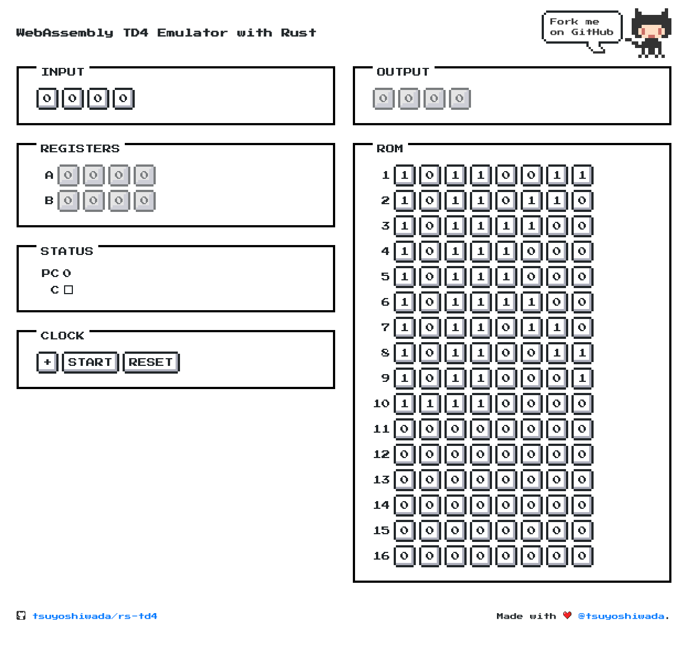

# rs-td4

> WebAssembly TD4 Emulator with Rust.

TD4 is a 4bit extremely simple CPU.  
This project implements TD4 in Rust, and uses WebAssembly to emulate the CPU on a web page.

## Try TD4 Emulator

https://wadackel.github.io/rs-td4/

- Auto Clock (1Hz)
- Manual Clock
- Write ROM
- Display registers, ports

## Thanks

- [CPU の創りかた](https://www.amazon.co.jp/CPU%E3%81%AE%E5%89%B5%E3%82%8A%E3%81%8B%E3%81%9F-%E6%B8%A1%E6%B3%A2-%E9%83%81/dp/4839909865)

## LICENSE

[MIT © tsuyoshiwada](./LICENSE)
